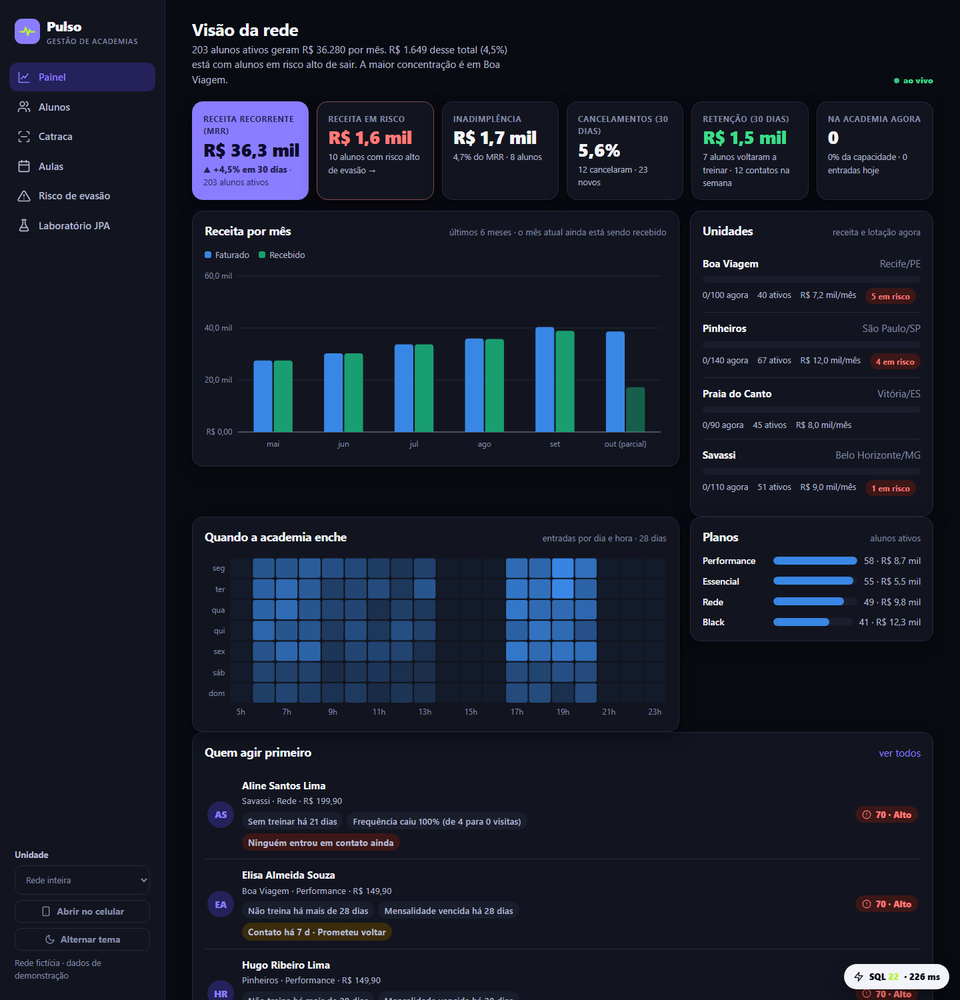
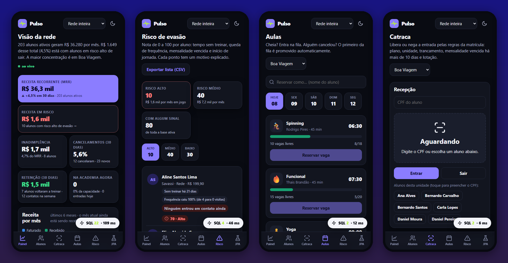
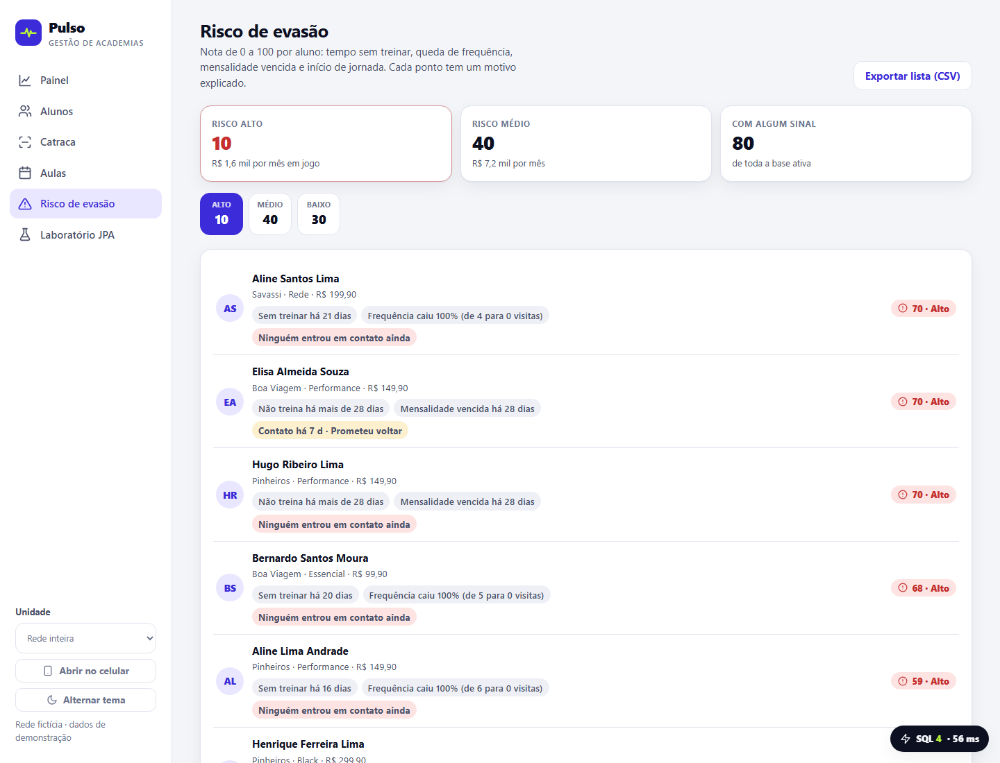
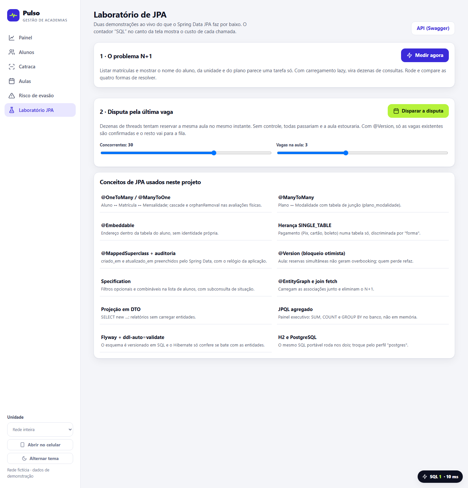
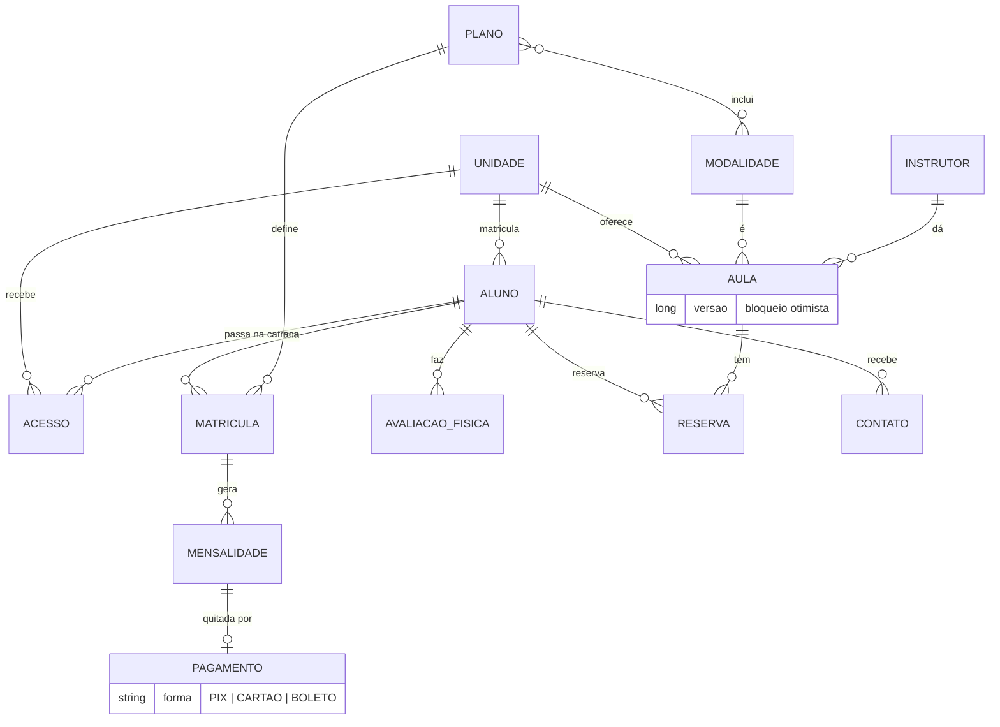

<div align="center">

# Pulso

**Gestão de redes de academias que avisa quem vai cancelar antes de cancelar.**

Painel executivo · catraca com regras · aulas com fila de espera · risco de evasão com motivos

Java 21 · Spring Boot 4 · **Spring Data JPA / Hibernate 7** · Flyway · H2 e PostgreSQL



</div>

## Por que existe

Uma academia perde dinheiro em silêncio: o aluno some, deixa a mensalidade vencer e cancela. Quando alguém percebe, já foi. O Pulso cruza **catraca, cobrança e agenda** para responder, em dez segundos, as perguntas de quem dirige uma rede:

- Quanto a rede fatura por mês e como isso se compara a 30 dias atrás?
- **Quanto desse dinheiro está com alunos prestes a sair, e quem são?**
- Onde estão a inadimplência e os cancelamentos?
- O time está agindo? Quanto foi recuperado?

Nasceu de um desafio da DIO sobre Spring Data JPA (a versão enxuta, com três entidades, está em [java-academia-spring-data-jpa](https://github.com/barbozadevti/java-academia-spring-data-jpa)). Aqui o mesmo domínio foi levado a um produto completo, com modelo de dados de verdade, regras de negócio, interface para celular e testes.

## O que faz

| Para quem | O que entrega |
|---|---|
| **Diretoria** | MRR com tendência, receita em risco, inadimplência, cancelamentos, retenção recuperada, lotação ao vivo, mapa de calor de horários, ranking de unidades |
| **Gerente de unidade** | Lista de risco com os **motivos** de cada nota, registro de contato (ligação, WhatsApp, presencial), exportação em CSV para o Excel |
| **Recepção** | Catraca que libera ou nega **dizendo por quê**: plano, unidade, trancamento, mensalidade vencida há mais de 10 dias, lotação |
| **Aluno** | Aulas com reserva; se estiver cheia, entra na fila e é promovido sozinho quando alguém cancela |
| **Todos** | Funciona no celular, instala como aplicativo (PWA), tema claro e escuro, QR Code para abrir no celular pela rede |



### Risco de evasão: transparente, não caixa-preta

Cada aluno recebe uma nota de 0 a 100 somando sinais que qualquer gerente entende:

| Sinal | Peso |
|---|---|
| Tempo sem treinar (máximo com 21 dias) | até 45 |
| Queda de frequência (2 últimas semanas contra as 2 anteriores) | até 25 |
| Mensalidade vencida | 25 |
| Menos de 60 dias de casa e treinando pouco | 10 |

A nota vem sempre com a lista de motivos ("Sem treinar há 18 dias", "Mensalidade vencida há 27 dias"). A regra é uma função pura ([`PontuacaoDeRisco`](src/main/java/dev/barboza/pulso/servico/PontuacaoDeRisco.java)), testada sem banco. A base inteira é avaliada em **três consultas SQL**, qualquer que seja o tamanho da rede.



## O que tem de JPA

Este projeto também é uma vitrine de Spring Data JPA, e cada recurso tem um motivo de existir:

| Recurso | Onde e para quê |
|---|---|
| `@OneToMany` / `@ManyToOne` | Aluno → Matrícula → Mensalidade; `cascade` e `orphanRemoval` nas avaliações |
| `@ManyToMany` | Plano ↔ Modalidade (tabela `plano_modalidade`) |
| `@Embeddable` | `Endereco` dentro do aluno, sem identidade própria |
| Herança `SINGLE_TABLE` | `Pagamento` (Pix, cartão, boleto) numa tabela, discriminada por `forma` |
| `@MappedSuperclass` + auditoria | `criado_em` e `atualizado_em` preenchidos pelo Spring Data com o relógio da aplicação |
| **`@Version`** (bloqueio otimista) | `Aula`: 40 threads disputando 3 vagas **nunca** geram overbooking; quem perde refaz com o estado novo |
| `Specification` | Filtros opcionais e combináveis na lista de alunos, com subconsulta de situação |
| `@EntityGraph` e `join fetch` | Eliminam o N+1 (veja o laboratório abaixo) |
| Projeção em DTO (`select new`) | Relatórios e listas sem carregar entidades |
| JPQL agregado | Painel: `SUM`, `COUNT`, `GROUP BY` no banco, não em memória |
| Dirty checking | Atualizações sem chamar `save` |
| Flyway + `ddl-auto=validate` | Esquema versionado em SQL portável; o Hibernate só confere se bate com as entidades |

### Laboratório de JPA (e o contador "SQL" em toda tela)

Toda resposta da API traz os cabeçalhos `X-Consultas-Sql` e `X-Tempo-Ms`, e o botão **SQL** no canto da tela abre o SQL real que o Hibernate gerou, via `StatementInspector`. É a prova de que cada tela tem um número pequeno e fixo de consultas.

O **Laboratório** mede, ao vivo, a mesma lista de 50 matrículas de quatro maneiras:

| Abordagem | Consultas SQL |
|---|---|
| Lazy padrão (N+1) | **58** |
| `@EntityGraph` | 2 |
| JPQL com `join fetch` | 2 |
| Projeção em DTO | 2 |

E dispara a **disputa pela última vaga**: dezenas de threads reservando a mesma aula no mesmo instante, com a conferência de que nunca há mais confirmados do que vagas.



## Modelo de dados



## Como rodar

Precisa de **Java 21** e Maven. Sem instalar banco (usa H2 em arquivo na pasta do usuário):

```bash
mvn spring-boot:run
```

Abre em **http://localhost:5310**. Na primeira execução o Pulso cria uma rede fictícia: 4 unidades (Vitória, São Paulo, Belo Horizonte e Recife), 246 alunos, seis meses de cobranças (algumas em atraso), avaliações físicas, catraca, contatos de retenção e a agenda dos próximos dias. A catraca "se mexe" sozinha, para o painel ao vivo ter o que mostrar.

No **Windows**, o arquivo `Abrir Pulso.cmd` compila (se preciso), inicia e abre o navegador. Para abrir no celular conectado ao mesmo Wi-Fi, use o botão **Abrir no celular** (gera um QR Code); na primeira vez, `Liberar Pulso no celular.cmd` cria a regra do firewall para redes privadas.

Com PostgreSQL:

```bash
docker compose up --build
```

A API tem documentação interativa em **/swagger-ui.html**. Variáveis úteis: `pulso.demo=false` (banco limpo), `pulso.simulador=false` (catraca parada).

## Decisões de projeto

- **Domínio e regras em classes simples, Spring só nas bordas.** A nota de risco, o CPF e as regras da `Aula` (reservar, cancelar, promover da fila) não dependem de banco nem de framework, por isso são testáveis em milissegundos.
- **Leitura separada da escrita.** As telas recebem modelos de leitura montados dentro da transação (`Visoes`), com número de consultas controlado. Nenhuma entidade sai pelo JSON.
- **Bloqueio otimista, não pessimista, nas reservas.** Em vez de travar a linha enquanto alguém decide, cada transação trabalha livre e só o commit confere a versão. Quem perde refaz com jitter. Aguenta disputa sem gargalo e sem deadlock.
- **SQL portável.** Os mesmos scripts do Flyway rodam em H2 e PostgreSQL; nada de `DATEADD` ou funções de um banco só.
- **CPF mascarado nas listas** (LGPD): o número completo só aparece na ficha do aluno.
- **Relógio injetável.** Tudo que depende de "hoje" recebe um `Clock`, então os testes usam uma data fixa e os resultados não mudam com o calendário.
- **Sem dependência de front-end.** Módulos ES e SVG puro (gráficos de barras, linha e mapa de calor feitos à mão), sem framework nem build.

## Testes

```bash
mvn verify
```

**30 testes**: regras puras (nota de risco, CPF), integração de ponta a ponta com a API sobre a rede de demonstração (painel, filtros e paginação, cadastro e validações, matrícula, cobrança nas três formas de pagamento, catraca com cada regra de bloqueio, reservas e fila de espera, retenção, CSV, máscara de CPF, número de consultas por tela) e a **disputa de 40 threads por 3 vagas**, sem `@Transactional`, com commits reais.

## Planejamento

O produto foi ordenado por uma Lean Inception (visão, personas, jornadas, sequenciador em ondas e canvas do MVP): [docs/lean-inception.md](docs/lean-inception.md).

## Limitações conhecidas

- **Sem login nem perfis ainda.** É a próxima onda (diretoria, gerente, recepção, aluno). Por isso o CPF já é mascarado nas listas, e os dados são todos fictícios.
- Pagamentos são **registrados**, não cobrados: não há integração com gateway.
- O banco da demonstração online (Render, plano gratuito) é em memória e reinicia com os dados de exemplo.
